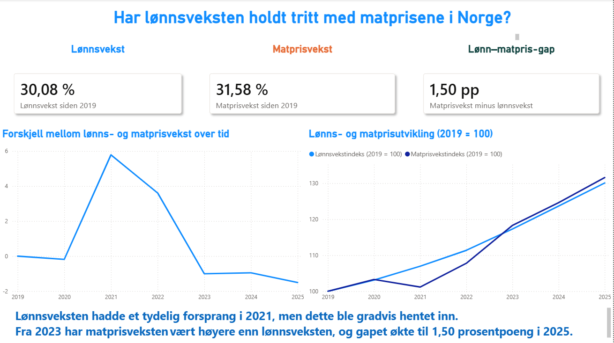

# Har lønnsveksten holdt tritt med matprisene?

**Power BI-analyse | Norge 2019–2025 | Data fra SSB**

I dette prosjektet undersøker jeg hvordan matprisene i Norge har utviklet seg sammenlignet med lønningene fra 2019 til 2025.

Målet var å finne ut om lønnsveksten har holdt tritt med matprisene, når utviklingen begynte å endre seg, og hvilke matvarekategorier som har hatt størst prisvekst.

## Kort oppsummert

Fra 2019 til 2025 økte matprisene med **31,58 %**, mens lønningene økte med **30,08 %**. Matprisene økte dermed **1,50 prosentpoeng mer enn lønningene**.

Forskjellen totalt er ganske liten, men det er store forskjeller mellom matvarekategoriene. Oljer og fett hadde for eksempel en prisvekst på **45,77 %**, som er **15,70 prosentpoeng over lønnsveksten**.

## Dashboard

## Problemstilling

Matprisene har økt betydelig de siste årene, men høyere priser alene sier ikke nødvendigvis noe om hvordan kjøpekraften har utviklet seg.

Jeg ønsket derfor å undersøke:

- Har lønnsveksten holdt tritt med matprisveksten fra 2019 til 2025?
- Når begynte matprisene å vokse raskere enn lønningene?
- Hvilke matvarekategorier har hatt størst prisvekst?

 ## Datagrunnlag og metode

Analysen bygger på offentlig tilgjengelige data fra Statistisk sentralbyrå (SSB) for perioden 2019–2025.

Jeg brukte to datasett:
- lønnsutvikling i Norge
- konsumprisindeks for matvarer og ulike matvarekategorier

Dataene ble klargjort og modellert i Power BI. For å gjøre utviklingen sammenlignbar satte jeg 2019 = 100 for både lønn og matpriser.

Deretter brukte jeg DAX til å beregne blant annet:
- samlet lønnsvekst siden 2019
- samlet matprisvekst siden 2019
- forskjellen mellom lønns- og matprisvekst
- prisvekst for hver matvarekategori

 ## Viktigste funn

- Totalt sett har lønninger og matpriser utviklet seg ganske likt siden 2019. Lønningene økte med 30,08 %, mens matprisene økte med 31,58 %.

- Forskjellen blir større når vi ser på enkelte matvarekategorier. Oljer og fett økte for eksempel med 45,77 %, betydelig mer enn lønnsveksten.

- I 2021 lå lønnsutviklingen tydelig foran matprisene. Dette forspranget ble gradvis hentet inn, og fra 2023 har matprisene ligget høyere enn lønnsutviklingen.

## Verktøy og ferdigheter

- Power BI – datamodellering og visualisering
- Power Query – klargjøring og transformasjon av data
- DAX – beregning av vekst, indekser og forskjeller
- Datavisualisering – utvikling over tid og sammenligning mellom kategorier
- Analyse – fra problemstilling til funn og konklusjon
